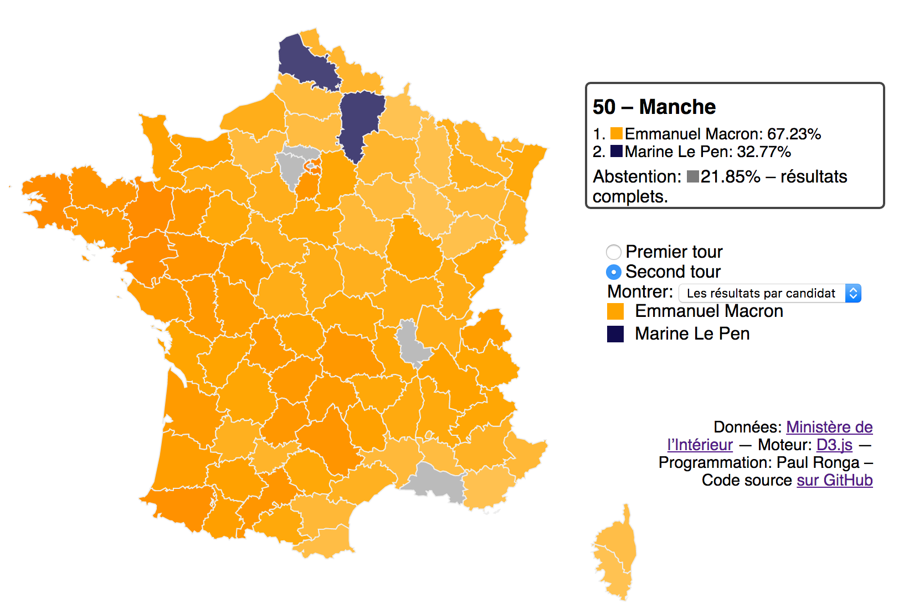

# Présidentielle française 2017

Visualisation D3 du résultat des deux tours des élections françaises (candidats et abstention), avec les données ouvertes d’OpenStreetMap et du Gouvernement français. Contient un notebook pour nettoyer les résultats par département transmis par le Ministère de l’intérieur et pour récupérer les résultats en temps réel.

